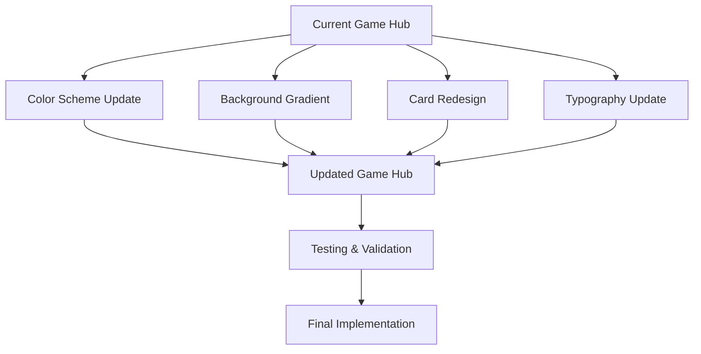

# Game Hub Design Update Plan

## Objective
Update the `stitch_retro_game_hub_home/code.html` game hub design to match the aesthetic of the Snake game (`prd2.html`).

## Analysis Summary

### Current Game Hub Design
- **Colors**: Primary `#4cae4f`, Accent gold `#FFD700`, Light background `#f6f7f6`, Dark background `#121212`
- **Typography**: 'Space Grotesk' Google Font
- **Layout**: Modern Tailwind CSS with light/dark mode toggle
- **Game Cards**: Slightly rounded corners, subtle borders, hover glow effects
- **Background**: Solid colors with light/dark variants

### Snake Game Design
- **Colors**: Primary `#4CAF50`, Secondary `#FF9800` (orange), `#2196F3` (blue), Error `#FF5252`
- **Typography**: 'Segoe UI', Tahoma, Geneva, Verdana, sans-serif
- **Layout**: Centered game container with gradient background
- **UI Elements**: Dark semi-transparent panels, distinct borders, pronounced shadows
- **Background**: `linear-gradient(135deg, #0c0c0c, #1a1a2e)`

## Implementation Plan

### 1. Color Scheme Updates
- Update primary color from `#4cae4f` to `#4CAF50` (slightly brighter green)
- Add secondary colors: `#FF9800` (orange), `#2196F3` (blue), `#FF5252` (red for errors)
- Update accent gold from `#FFD700` to a more subtle gold that matches Snake game's score highlights
- Modify background colors to use gradient instead of solid

### 2. Background Gradient Implementation
**Dark Mode:**
- Replace `bg-background-dark` (`#121212`) with `linear-gradient(135deg, #0c0c0c, #1a1a2e)`
- Apply to body and main containers

**Light Mode:**
- Keep light background but add subtle gradient: `linear-gradient(135deg, #f0f0f0, #e0e0e0)`
- Ensure sufficient contrast for readability

### 3. Game Card Redesign
- Update card backgrounds from `bg-card-dark` (`#1e1e1e`) to `rgba(0, 0, 0, 0.5)` with backdrop blur
- Modify borders from `border-white/5` to `1px solid #333`
- Increase border radius from `rounded-xl` to `8px` (Tailwind: `rounded-lg`)
- Add box shadows: `0 5px 20px rgba(0,0,0,0.5)`
- Update hover effects to match Snake game's button interactions

### 4. Typography Updates
- Change font family from 'Space Grotesk' to 'Segoe UI', Tahoma, Geneva, Verdana, sans-serif
- Adjust font weights and sizes to match Snake game's hierarchy
- Update text colors for better contrast

### 5. Component-Specific Updates

#### Navigation Bar
- Update background to semi-transparent dark with backdrop blur
- Modify search input styling to match Snake game's input fields
- Update user profile avatar border colors

#### Hero Section
- Update featured game card to use new gradient background
- Modify button styles to match Snake game's `.btn` classes
- Adjust glow effects to be more subtle

#### Stats Overview Cards
- Redesign stat cards with dark semi-transparent backgrounds
- Update typography and spacing
- Add subtle borders and shadows

#### Game Grid Cards
- Apply uniform card redesign to all game cards
- Update high score displays to use gold accent color
- Modify hover animations for consistency

### 6. Dark/Light Mode Consistency
- Ensure all updates work correctly in both color schemes
- Test contrast ratios for accessibility
- Verify gradient backgrounds work in both modes

## Technical Implementation Steps

1. **Update Tailwind Configuration** (`tailwind.config` in `<script>`)
   - Modify color palette
   - Update background colors
   - Adjust border radius values

2. **Modify CSS Styles** (in `<style>` section)
   - Add gradient background classes
   - Update font family declarations
   - Create new utility classes for Snake game aesthetics

3. **Update HTML Structure**
   - Apply new CSS classes to existing elements
   - Modify component layouts where necessary
   - Update color class references

4. **Testing**
   - Test in multiple viewport sizes (mobile, tablet, desktop)
   - Verify dark/light mode switching
   - Check browser compatibility (Chrome, Firefox, Safari)
   - Validate accessibility (contrast, keyboard navigation)

## Files to Modify
- `stitch_retro_game_hub_home/code.html` - Primary file to update
- Consider creating a backup before making changes

## Success Criteria
- Game hub visually matches Snake game's aesthetic
- Consistent color scheme across all components
- Proper functionality in both light and dark modes
- Maintained responsiveness across device sizes
- Improved visual hierarchy and readability

## Next Steps
1. Review this plan with stakeholders
2. Create a backup of the current implementation
3. Implement changes systematically
4. Test thoroughly before deployment
5. Gather feedback and make iterative improvements

## Visual Reference

This plan provides a clear roadmap for updating the game hub design to match the Snake game's aesthetic while maintaining functionality and user experience.