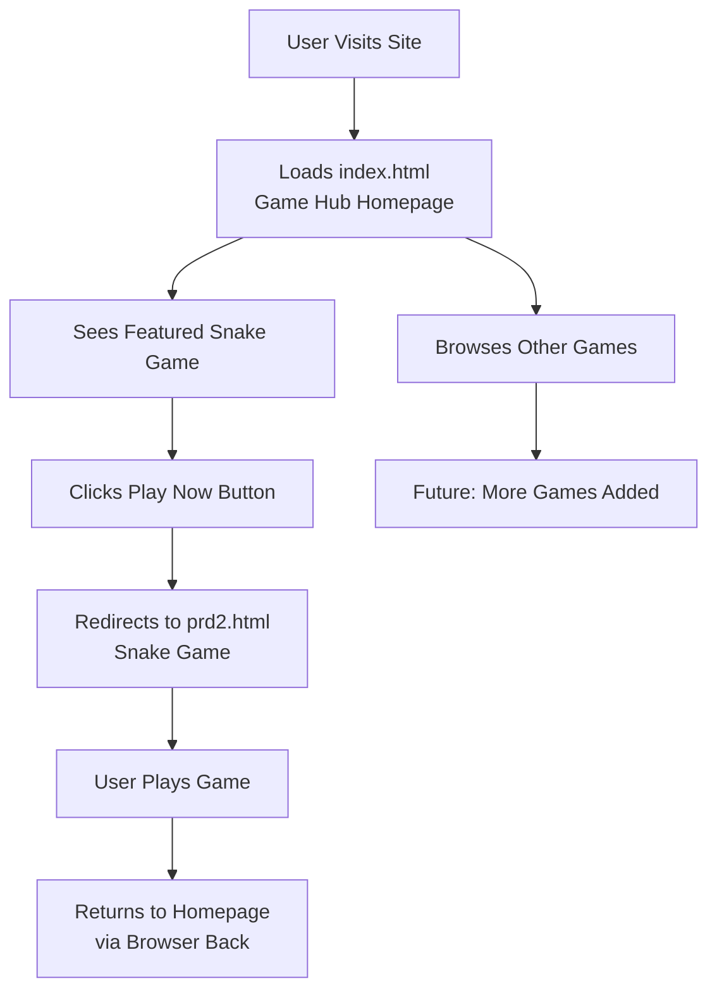

# Homepage Integration Plan

## Objective
Create a unified homepage (`index.html`) that combines the retro game hub (`stitch_retro_game_hub_home/code.html`) with the Snake game (`prd2.html`).

## Overview
The homepage will serve as the main entry point, featuring:
1. A modern retro game hub interface
2. Prominent featuring of the Snake game
3. Navigation to play the Snake game
4. Consistent styling across both components

## Implementation Strategy

### 1. Base Structure
- Use the game hub (`stitch_retro_game_hub_home/code.html`) as the foundation
- Keep Tailwind CSS for responsive design
- Maintain dark/light mode toggle functionality

### 2. Snake Game Integration
**Approach**: Link-based integration (recommended)
- The Snake game remains in `prd2.html` as a standalone game
- The homepage features the Snake game prominently in the hero section
- "Play Now" button links to `prd2.html` (opens in same tab)
- This ensures game functionality remains intact

**Alternative**: Embedded preview (if requested)
- Could embed a simplified preview of the Snake game
- Would require significant refactoring to isolate game logic

### 3. Homepage Structure
```
1. Header Navigation
   - Logo: "Vernice's Game"
   - Nav: Home, Arcade, High Scores, Community
   - Search bar, Settings, User profile

2. Hero Section (Featured Game)
   - Title: "Neon Snake (霓虹貪食蛇)"
   - Description: Snake game description
   - Play Now button (links to prd2.html)
   - View Leaderboard button
   - High score display
   - Game preview image

3. Stats Overview
   - Active Players
   - Global High Scores  
   - Server Status

4. Arcade Classics Grid
   - Pixel Platformer
   - Space Invaders
   - Tetris Variant
   - Retro Racer
   - (Add Snake game card here too)

5. Footer
   - Copyright
   - Links: Terms, Privacy, Support, Community
```

### 4. Styling Updates
To create visual consistency with the Snake game:

**Color Scheme Updates:**
- Primary color: `#4CAF50` (from Snake game)
- Secondary colors: `#FF9800` (orange), `#2196F3` (blue)
- Background: `linear-gradient(135deg, #0c0c0c, #1a1a2e)` for dark mode
- Card backgrounds: `rgba(0, 0, 0, 0.5)` with backdrop blur

**Typography:**
- Keep 'Space Grotesk' for headings (game hub style)
- Consider adding 'Segoe UI' as fallback for body text

**Component Styling:**
- Update buttons to match Snake game's `.btn` style
- Modify game cards to have darker backgrounds with borders
- Add consistent box shadows and hover effects

### 5. Navigation & User Flow
```
Homepage (index.html)
    ↓
Click "Play Now" on Snake game card
    ↓
Snake Game (prd2.html) opens
    ↓
User plays game
    ↓
Browser back button returns to homepage
```

### 6. Responsive Design
- Game hub is already responsive with Tailwind
- Ensure Snake game links work on all devices
- Test on mobile, tablet, and desktop viewports

## Technical Implementation Steps

### Phase 1: Create Homepage Foundation
1. Copy `stitch_retro_game_hub_home/code.html` to `index.html`
2. Update page title and metadata
3. Modify hero section to feature Snake game specifically

### Phase 2: Update Styling
1. Update Tailwind config colors to match Snake game palette
2. Modify CSS for gradient backgrounds
3. Update component styles (buttons, cards, etc.)

### Phase 3: Integrate Snake Game
1. Update hero section "Play Now" button to link to `prd2.html`
2. Add Snake game to the arcade classics grid
3. Ensure all links work correctly

### Phase 4: Testing
1. Test homepage navigation
2. Verify Snake game link works
3. Test responsive design
4. Check dark/light mode switching

## Files to Create/Modify
1. `index.html` - New homepage (primary file)
2. `prd2.html` - Snake game (unchanged, linked from homepage)
3. Backup of original game hub: `stitch_retro_game_hub_home/code.html.backup`

## Success Criteria
1. Homepage loads successfully with game hub interface
2. Snake game is prominently featured
3. "Play Now" button correctly links to Snake game
4. Consistent styling across both experiences
5. Responsive design works on all devices
6. Dark/light mode functions properly

## Next Steps
1. Review this plan with stakeholders
2. Begin implementation in Code mode
3. Test thoroughly before deployment
4. Gather user feedback for improvements

## Visual Workflow


This plan provides a clear path to creating a unified homepage that showcases both the game hub and the Snake game effectively.